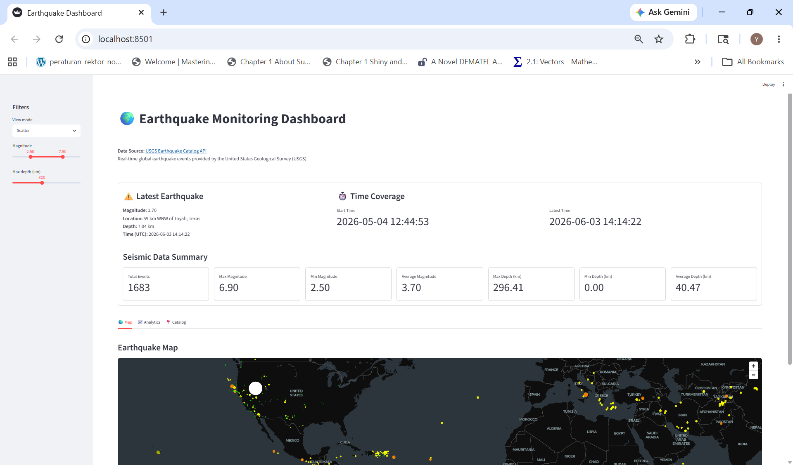
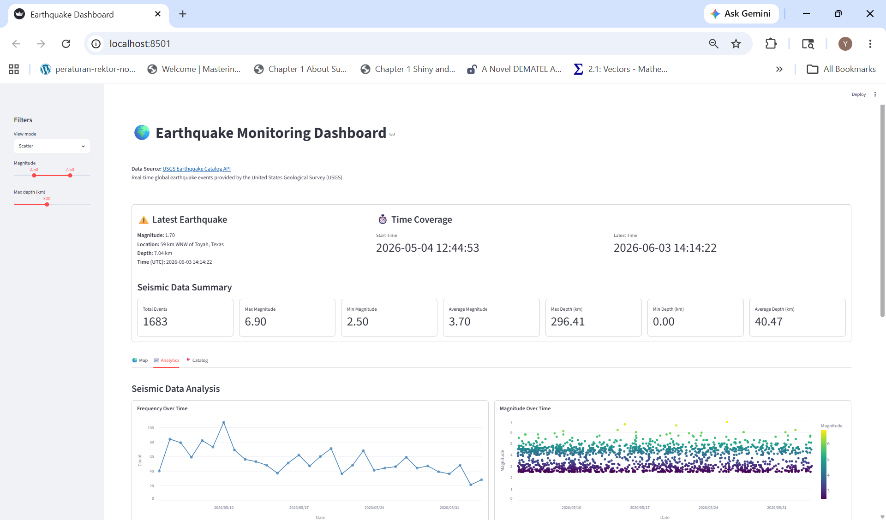
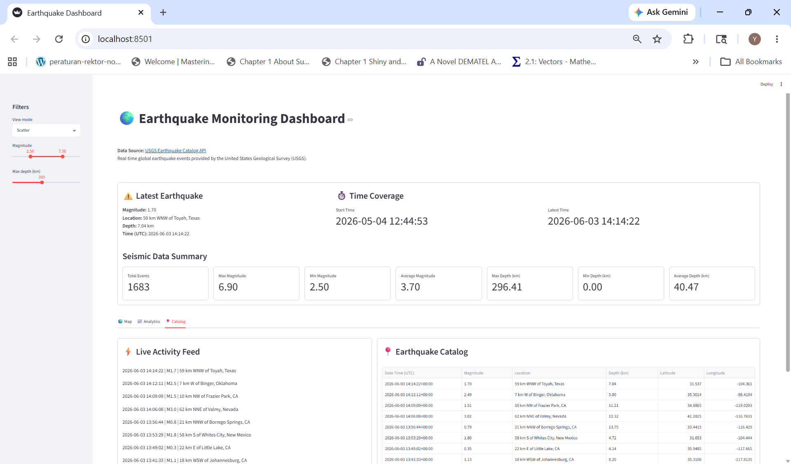

# 🌍 Earthquake Data Dashboard (USGS + Streamlit + SQLite)

A data dashboard application built with Streamlit to explore global earthquake patterns through interactive visualizations, supported by a lightweight ETL pipeline using the USGS API and SQLite.


## 🎯 Project Goal

Demonstrate the development of an end-to-end analytics dashboard, from data ingestion and storage to exploratory analysis and interactive visualization of global earthquake activity.


## 🚀 Live Application

The dashboard is deployed and accessible online:
👉 **[Launch Earthquake Monitoring Dashboard](https://earthquake-monitoring-dashboard.streamlit.app/)**


## 📷 Dashboard Preview

### Overview (Map & KPIs)


### Analytics


### Catalog

---

## 📊 Overview

* Extracts earthquake data from the USGS API
* Stores structured data in SQLite
* Uses watermark logic to prevent duplicate ingestion
* Supports historical backfill and incremental updates
* Cleans and validates incoming data
* Performs exploratory time-series analysis, including event frequency, magnitude trends, and 7-day rolling averages
* Analyzes magnitude and depth distributions to identify earthquake patterns
* Visualizes results using Streamlit

---

## 🏗️ Architecture

```text
USGS API
    │
    ▼
ETL Process
(Backfill + Incremental Updates)
    │
    ▼
SQLite Database (earthquake.db)
    │
    ▼
Streamlit Dashboard
```

---

## ⚙️ Tech Stack

* Python
* Streamlit
* SQLite
* Pandas
* Requests
* Altair

---

## 📁 Project Structure

```text
StreamlitEarthquakeDashboard/
├── assets/
│   └── streamlit_dashboard_1.png
│   └── streamlit_dashboard_2.png
│   └── streamlit_dashboard_3.png
├── components/
│   ├── analytics_tab.py
│   ├── catalog_tab.py
│   ├── map_tab.py
│   ├── sidebar.py
│   ├── kpis.py
│   └── plots.py
│
├── data/
│   └── earthquake.db
│
├── modules/
│   ├── add_features.py
│   ├── compute_global_stats.py
│   ├── data_processing.py
│   ├── earthquake_filtering.py
│   ├── init_db_and_sync.py
│   └── init_ui_state.py
│
├── scripts/
│   └── run_backfill.py
│
├── src/
│   ├── archived/
│   │   └── archive.py
│   ├── db/
│   │   └── database.py
│   └── etl/
│       ├── fetch_historical_usgs.py
│       └── fetch_usgs.py
│
├── app.py
├── requirements.txt
└── README.md
```

---

## 🧹 Data Handling Steps

* Fetch earthquake data from the USGS API (GeoJSON format)
* Filter out records with missing magnitude values
* Convert and validate numeric fields (magnitude, coordinates, depth)
* Normalize timestamps for consistent storage
* Prevent duplicates using `INSERT OR IGNORE`
* Use watermark (latest timestamp) for incremental ingestion
* Maintain data consistency across repeated runs

---

## 📈 Dashboard Features

* Latest earthquake summary and seismic activity coverage
* Interactive map visualization of earthquake events
* Event frequency trends over time
* Magnitude trends and 7-day rolling average analysis
* Magnitude and depth distribution analysis
* Interactive filtering by magnitude, depth, and map type
* Detailed tooltips displaying location, magnitude, depth, and timestamp
* Clean and responsive Streamlit interface

---

## 🗄️ Database Schema

```sql
CREATE TABLE earthquakes (
    id TEXT PRIMARY KEY,
    magnitude REAL,
    place TEXT,
    time INTEGER,
    longitude REAL,
    latitude REAL,
    depth REAL
);
```

---

## ▶️ How to Run Locally

### 1. Install Dependencies

```bash
pip install -r requirements.txt
```

### 2. Run Backfill (First-Time Setup)

```bash
python -m scripts.run_backfill
```

### 3. Start the Streamlit Application

```bash
streamlit run app.py
```

---

## 👤 Author

**Nurul Yakim Kazal**

Dashboard Developer specializing in Streamlit, Dash, and R Shiny applications. Experienced in combining data engineering and analytical workflows to build end-to-end interactive data products.
