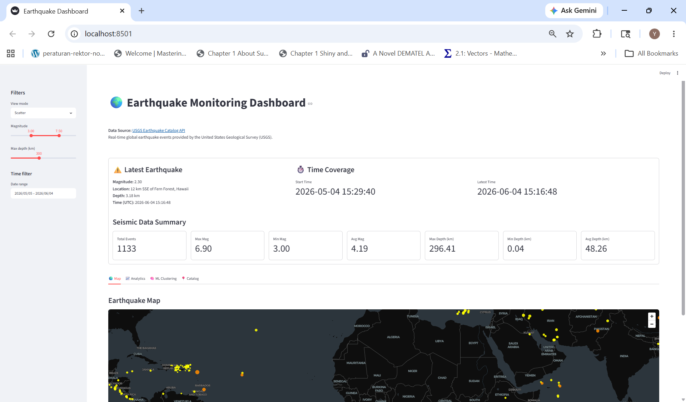
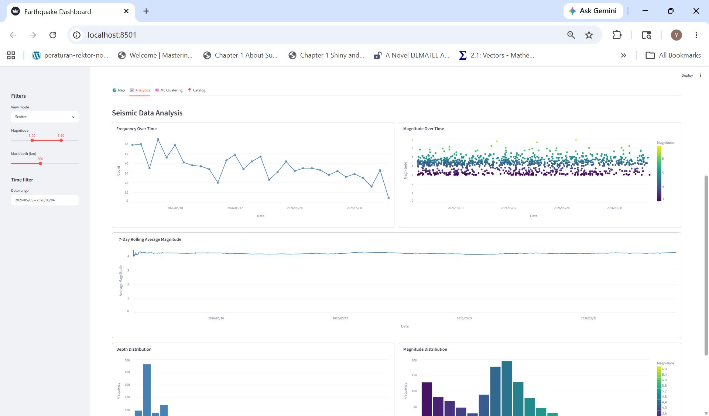
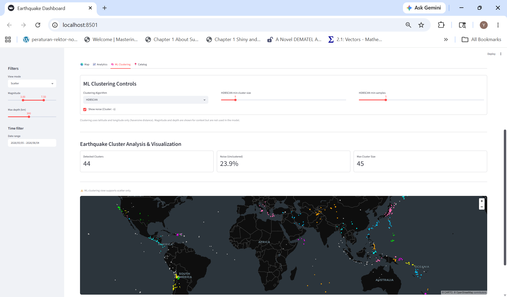
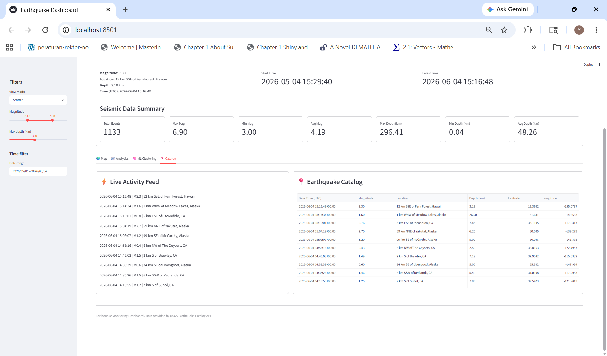

# 🌍 Earthquake Data Dashboard (USGS + Streamlit + SQLite + ML Clustering)

A data dashboard application built with Streamlit to explore global earthquake patterns through interactive visualizations, supported by a lightweight ETL pipeline using the USGS API and SQLite. The project also includes machine learning-based spatial clustering (DBSCAN & HDBSCAN) to identify seismic activity patterns.

---

## 🎯 Project Goal

Demonstrate the development of an end-to-end analytics dashboard, from data ingestion and storage to exploratory analysis, machine learning clustering, and interactive visualization of global earthquake activity.

---

## 🚀 Live Application

The dashboard is deployed and accessible online:
👉 **[Launch Earthquake Monitoring Dashboard](https://earthquake-monitoring-dashboard.streamlit.app/)**

---

## 📷 Dashboard Preview

### Overview (Map & KPIs)


### Analytics


### ML Clustering


### Catalog

---

## 📊 Overview

* Extracts earthquake data from the USGS API
* Stores structured data in SQLite
* Uses watermark logic to prevent duplicate ingestion
* Supports historical backfill and incremental updates
* Cleans and validates incoming data
* Performs exploratory time-series analysis (event frequency, magnitude trends, rolling averages)
* Analyzes magnitude and depth distributions to identify seismic patterns
* Applies ML clustering (DBSCAN & HDBSCAN) to detect spatial earthquake groupings
* Visualizes results using Streamlit and PyDeck

---

## 🧠 Machine Learning (Clustering)

The dashboard includes unsupervised clustering to identify earthquake spatial patterns.

### Algorithms
- DBSCAN (Density-Based Spatial Clustering)
- HDBSCAN (Hierarchical Density-Based Clustering)

### Key Details
- Clustering is based **only on latitude and longitude**
- Distance metric: **Haversine (geographic distance)**
- Magnitude and depth are used only for visualization, not clustering
- Noise points are labeled as `-1`

### Controls
- Switch between DBSCAN and HDBSCAN
- Tune parameters:
  - DBSCAN: `eps (km)`, `min_samples`
  - HDBSCAN: `min_cluster_size`, `min_samples`
- Toggle noise visibility

---

## 🏗️ Architecture

```text
                USGS API
                    │
                    ▼
        ETL Pipeline (Backfill + Incremental)
                    │
                    ▼
            SQLite Database
             (earthquake.db)
                    │
        ┌───────────┼───────────┐
        ▼           ▼
 Data Catalog   Filter Engine
 (raw table)    (user filters)
        │           │
        │           ▼
        │    Filtered Dataset (shared input)
        │           │
        │     ┌─────┼─────┐
        │     ▼           ▼
        │  Analytics   ML Clustering
        │ (stats,      (DBSCAN /
        │ summaries)    HDBSCAN)
        │     │           │
        └─────┴─────┬─────┘
                    ▼
            Streamlit Dashboard Layer
        (state + UI + view routing)
                      │
     ┌────────────────┼────────────────┐
     ▼                ▼                ▼
 PyDeck Map        Charts         Data Table
(spatial view)   (distributions,   (RAW ONLY)
                time series)
                      │
                      ▼
        Linked Interactive Visualization
 (all views react to filters, clustering optional overlay)
```

---

## ⚙️ Tech Stack

* Python
* Streamlit
* SQLite
* Pandas
* NumPy
* Scikit-learn
* HDBSCAN
* PyDeck
* Altair
* Requests

---

## 📁 Project Structure

```text
StreamlitEarthquakeDashboard/
├── assets/
│   └── streamlit_dashboard_1.png
│   └── streamlit_dashboard_2.png
│   └── streamlit_dashboard_3.png
│   └── streamlit_dashboard_4.png
│
├── components/
│   ├── analytics_tab.py
│   ├── catalog_tab.py
│   ├── kpis.py
│   ├── map_tab.py
│   ├── ml_clustering_tab.py
│   ├── ml_filters.py
│   ├── plots.py
│   └── sidebar.py
│
├── data/
│   └── earthquake.db
│
├── modules/
│   ├── add_features.py
│   ├── compute_global_stats.py
│   ├── data_processing.py
│   ├── earthquake_filtering.py
│   ├── init_db_and_sync.py
│   ├── init_ui_state.py
│   └── ml_data_processing.py
│
├── scripts/
│   └── run_backfill.py
│
├── src/
│   ├── archived/
│   │   └── archive.py
│   ├── db/
│   │   └── database.py
│   └── etl/
│       ├── fetch_historical_usgs.py
│       └── fetch_usgs.py
│
├── app.py
├── requirements.txt
└── README.md
```

---

## 🧹 Data Handling Steps

* Fetch earthquake data from USGS API (GeoJSON format)
* Filter invalid or missing magnitude records
* Convert and validate numeric fields (magnitude, coordinates, depth)
* Normalize timestamps for consistent storage
* Prevent duplicates using `INSERT OR IGNORE`
* Use watermark (latest timestamp) for incremental ingestion
* Ensure clean structured dataset for analytics + ML

---

## 📈 Dashboard Features

* Latest earthquake summary and seismic activity coverage
* Interactive PyDeck map visualization of earthquake events
* ML-based cluster visualization (DBSCAN/HDBSCAN)
* Event frequency trends over time
* Magnitude trends and 7-day rolling average analysis
* Magnitude and depth distribution analysis
* Interactive filtering by map type, magnitude, depth, and time
* Tooltips with detailed event information
* Noise detection and filtering (cluster = -1)
* Clean and responsive Streamlit interface

---

## 🗄️ Database Schema

```sql
CREATE TABLE earthquakes (
    id TEXT PRIMARY KEY,
    magnitude REAL,
    place TEXT,
    time INTEGER,
    longitude REAL,
    latitude REAL,
    depth REAL
);
```

---

## ▶️ How to Run Locally

### 1. Install Dependencies

```bash
pip install -r requirements.txt
```

### 2. Run Backfill (First-Time Setup)

```bash
python -m scripts.run_backfill
```

### 3. Start the Streamlit Application

```bash
streamlit run app.py
```

---

## 👤 Author

**Nurul Yakim Kazal**

Data and analytics developer focused on building end-to-end data applications that combine data engineering, machine learning, and interactive visualization. I specialize in developing production-ready dashboards using Streamlit, and also have experience building interactive applications with Dash.

My work involves designing ETL pipelines, processing and transforming data, and creating intuitive user interfaces that make data exploration and analysis more accessible and effective.