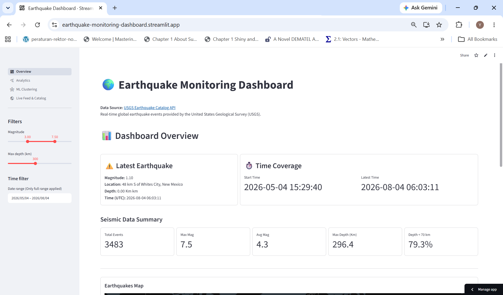
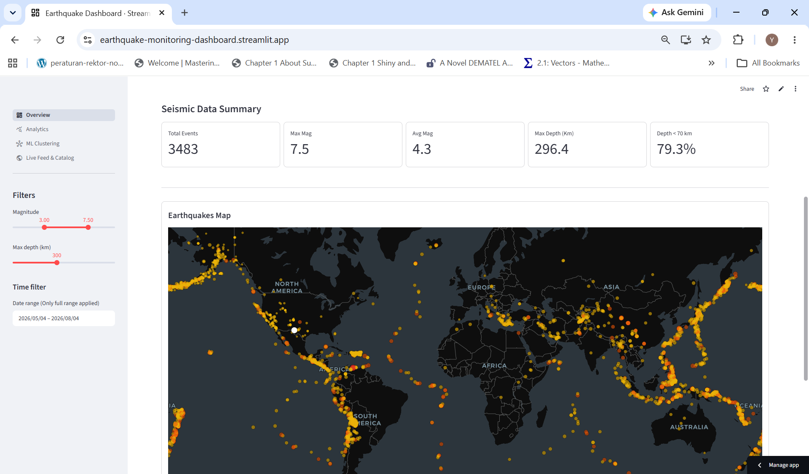
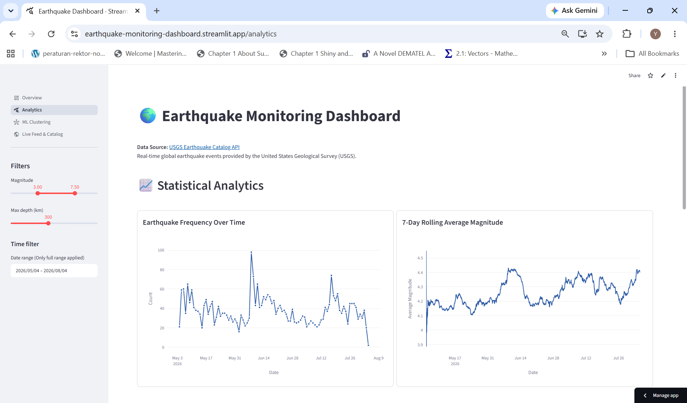
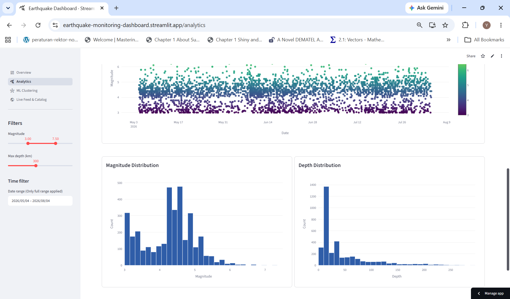
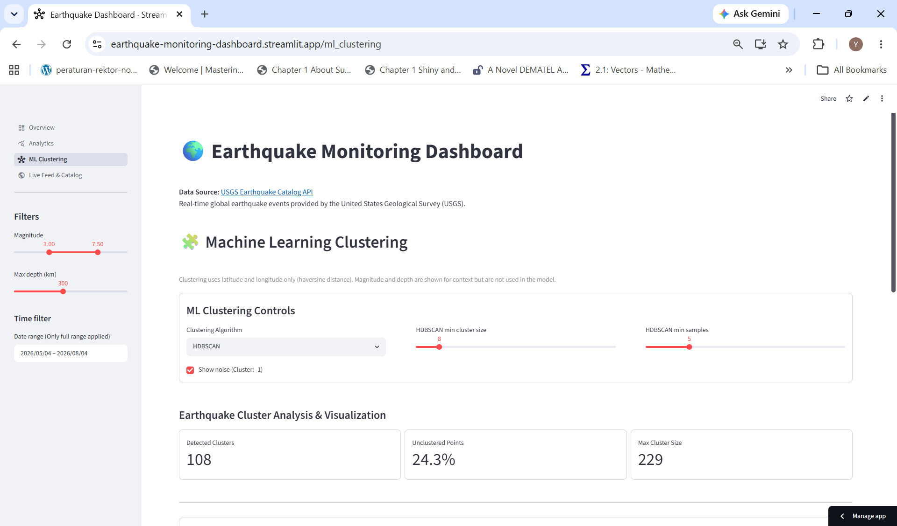
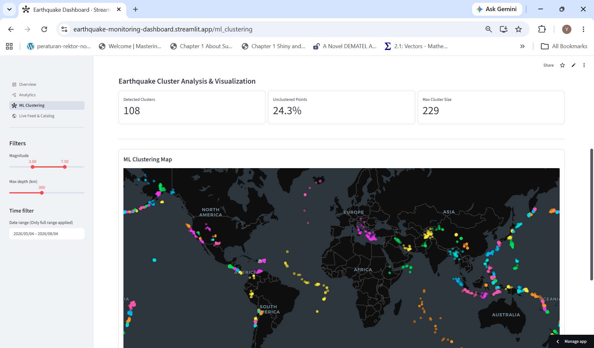
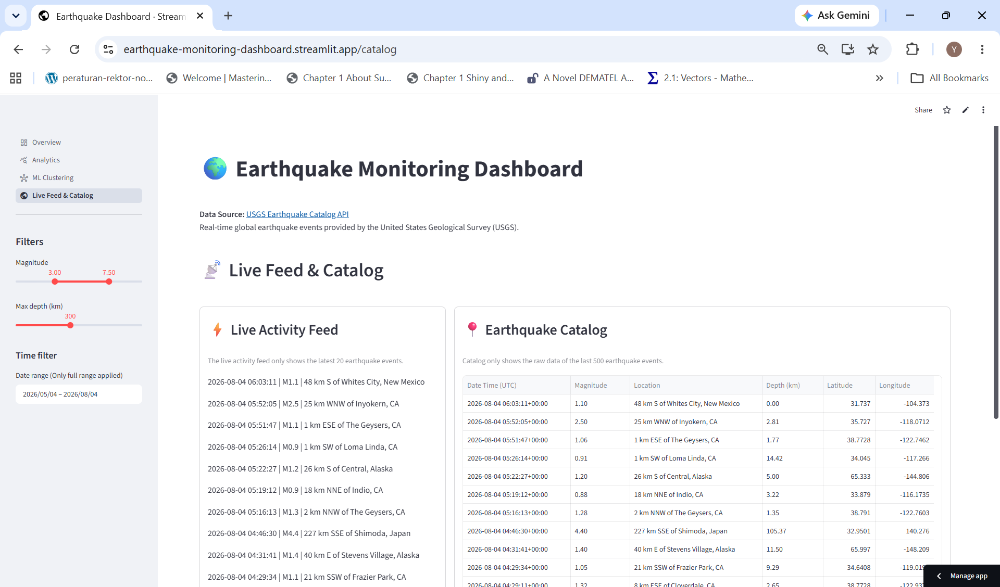

# 🌍 Earthquake Monitoring & Analytics Platform

A real-time multipage earthquake analytics system for geospatial visualization, time-series analysis, statistical exploration, and unsupervised machine learning.

The platform collects earthquake events from the USGS API, stores structured records in SQLite, and provides interactive analysis through a Streamlit multipage dashboard.

---

## 🚀 Live Application

The dashboard is deployed and accessible online:
👉 **[Launch Earthquake Monitoring Dashboard](https://earthquake-monitoring-dashboard.streamlit.app/)**

---

## 🧭 Project Overview

This platform integrates:

* Real-time earthquake monitoring using the USGS API
* Global earthquake visualization
* Time-series analysis of seismic activity
* Statistical analysis of magnitude and depth
* Spatial pattern discovery using unsupervised clustering

The Streamlit multipage architecture separates each analytical workflow into dedicated pages while sharing the same database and processing pipeline.

---

## 🏗️ System Architecture

The system follows a layered architecture:
```text
USGS Earthquake API 
        │   
        ▼ 
ETL Pipeline (Backfill + Incremental Updates) 
        │ 
        ▼ 
SQLite Database (earthquake.db) 
        │   
        ▼   
Analytics & Machine Learning Layer 
        │ 
        ▼ Streamlit Multipage Application 
        │ 
        ├── Map & Monitoring 
        ├── Time-Series Analytics 
        ├── Statistical Analysis 
        ├── ML Clustering 
        └── Earthquake Catalog
```
---

## ✨ Key Features

### 🌍 Geospatial Visualization
* Interactive earthquake map
* Magnitude-based encoding
* Global event coverage
### 📊 Time-Series Analytics
* Earthquake frequency trends
* Magnitude over time visualization
* Rolling average smoothing (7-day window)
### 📈 Statistical Insights
* Magnitude distribution analysis
* Depth distribution patterns
### 🧠 Machine Learning Integration
* DBSCAN clustering for spatial grouping
* HDBSCAN for density-based clustering
* Interactive parameter controls (epsilon, min samples, etc.)
### 🔴 Real-Time Monitoring
* Updated earthquake event feed
* Magnitude-based monitoring (M ≥ 5)
* Event catalog exploration

---

## 🧰 Tech Stack

* Python
* Streamlit
* Pandas
* NumPy
* Plotly
* Scikit-learn
* HDBSCAN
* SQLite
* Requests (USGS API)

---

## 🧹 Data Engineering Pipeline

The pipeline:

* Retrieves earthquake events from the USGS GeoJSON API
* Cleans and validates records
* Normalizes timestamps
* Prevents duplicate ingestion
* Performs incremental updates using watermarks
* Stores structured earthquake data in SQLite

---

## 🧠 Machine Learning Details

* Clustering uses only latitude & longitude
* Distance metric: Haversine (geospatial distance)
* Noise points labeled as -1
* Magnitude & depth used only for visualization

### Controls
* Switch between DBSCAN and HDBSCAN 
* Tune parameters (eps, min_samples, cluster size)
* Toggle noise visibility

---
## 📁 Project Structure
```text
StreamlitEarthquakeDashboard/
├── .streamlit/             # Streamlit configuration
├── assets/                 # dashboard screenshots
├── components/             # reusable UI components
├── data/                   # SQLite database
├── modules/                # processing and feature engineering
├── pages/                  # Streamlit app pages
├── scripts/                # batch jobs (backfill)
├── src/                    # ETL and database layer
│   ├── archived/
│   ├── db/
│   └── etl/
├── app.py                  # Streamlit entry point
├── requirements.txt
└── README.md
```

---

## 📸 Screenshots

### 📊 Dashboard Overview

Overview of earthquake activity, key metrics, and spatial distribution.




### 📈 Statistical Analytics

Frequency trends, rolling averages, magnitude changes, and magnitude/depth distributions.




### 🧩 Machine Learning Clustering

Spatial grouping using DBSCAN and HDBSCAN.




### 📡 Live Feed & Catalog

Earthquake event records and monitoring interface.



---
## ▶️ How to Run Locally

### 1. Install Dependencies

```bash
pip install -r requirements.txt
```

### 2. Run Backfill (First-Time Setup)

```bash
python -m scripts.run_backfill
```

### 3. Start the Streamlit Application

```bash
streamlit run app.py
```

---

## 👤 Author

**Nurul Yakim Kazal**  
Lecturer, Department of Mathematics, Universitas Sam Ratulangi

Focus areas:
* Numerical Linear Algebra (academic)
* Data engineering & ETL systems
* Interactive analytics dashboards (Streamlit / Dash)
* Geospatial & time-series analytics
